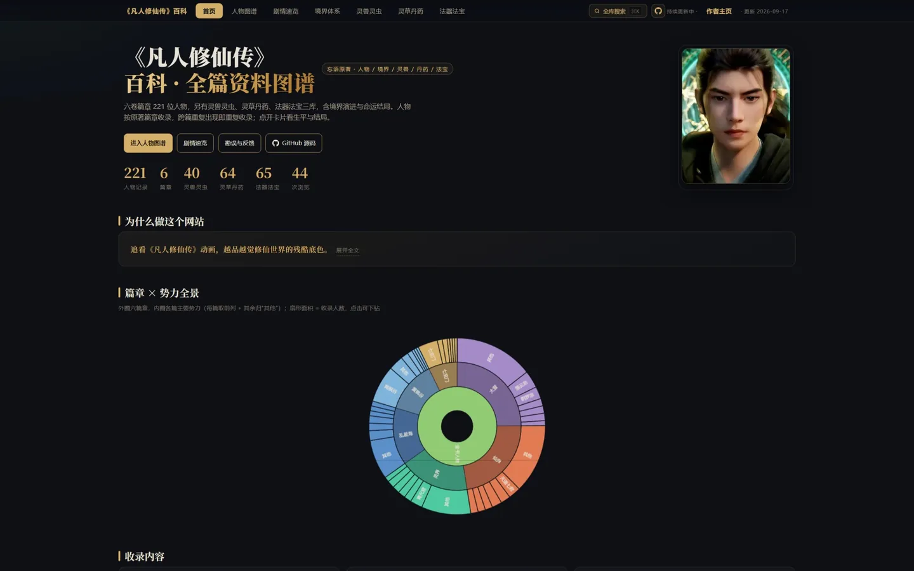
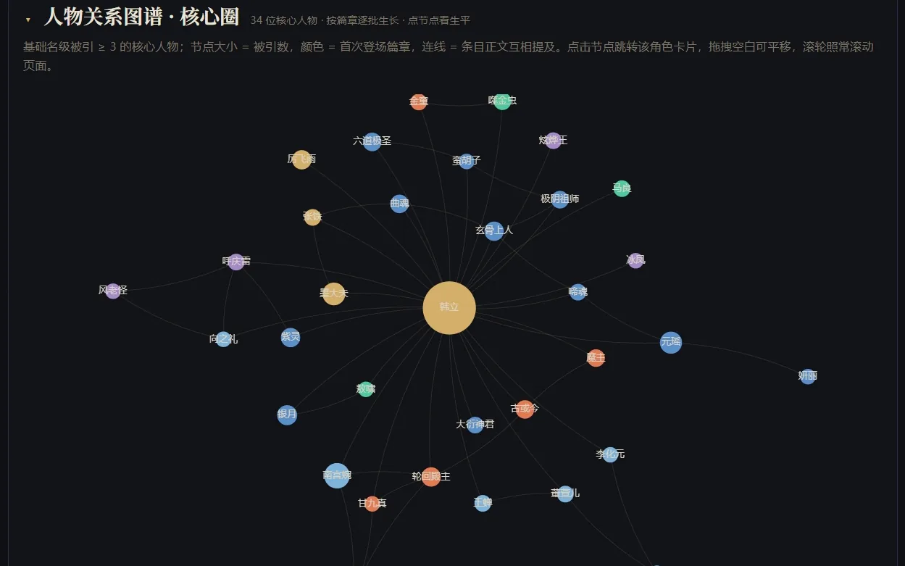
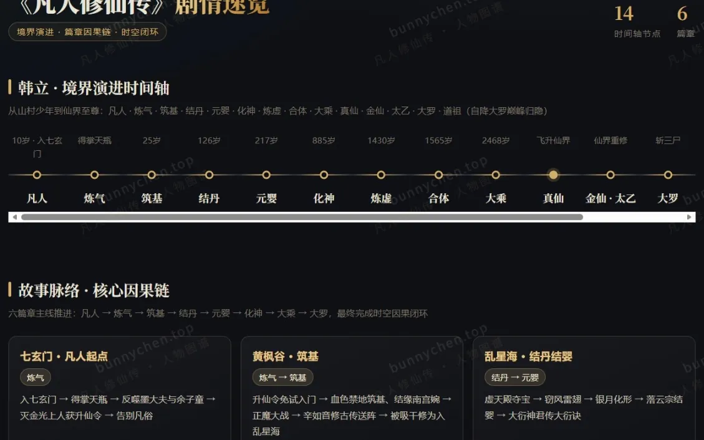
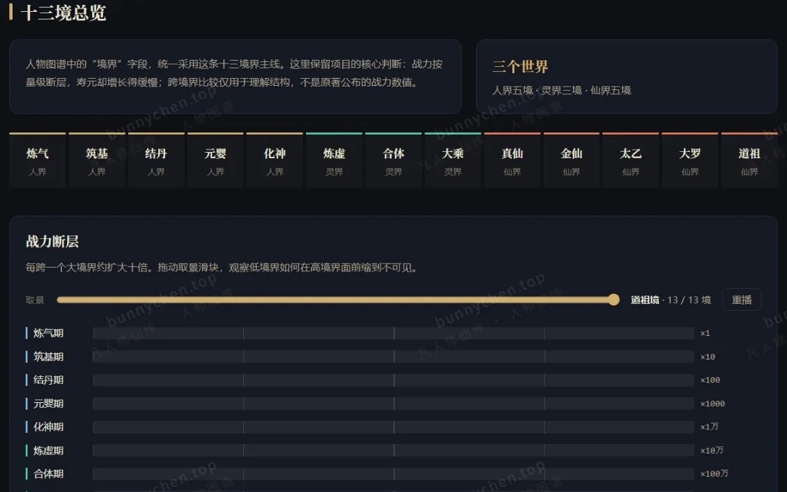
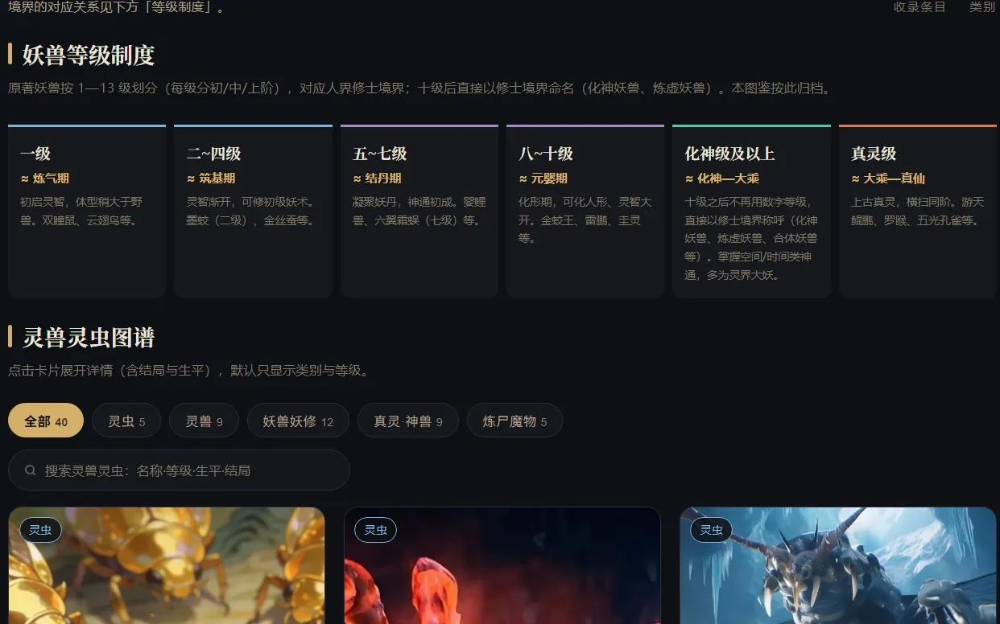
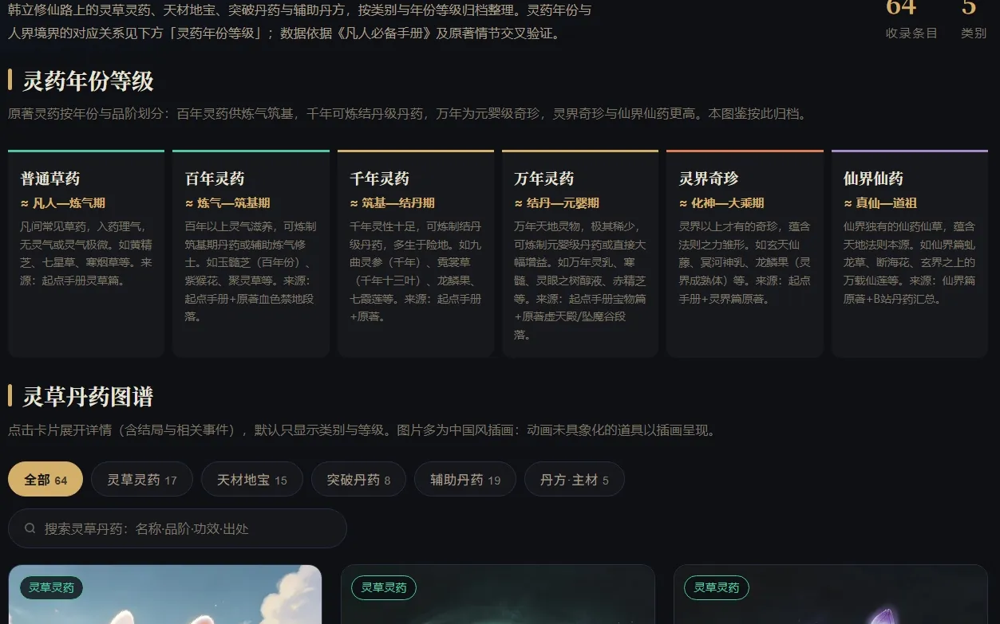
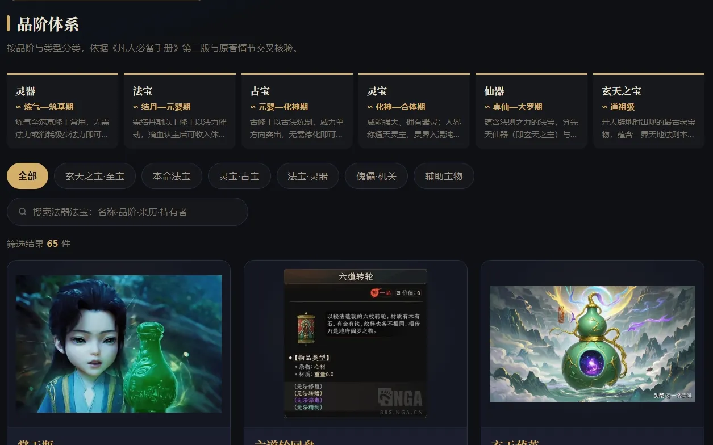

  

  <h1 align="center">《凡人修仙传》百科 · 全篇资料图谱</h1>

  
六个篇章 <b>二百余</b> 位人物 · 灵兽灵虫 / 灵草丹药 / 法器法宝 <b>169</b> 条 
  自包含单页静态站 —— 零构建 · 零依赖 · 零 CDN

  
<b>在线访问</b> → <a href="https://bunnychen.top/fanren-wiki/">bunnychen.top/fanren-wiki</a>

## 页面速览

  

| 人物图谱 | 剧情速览 |
| :---: | :---: |
|  |  |

| 境界体系 | 灵兽灵虫 |
| :---: | :---: |
|  |  |

| 灵草丹药 | 法器法宝 |
| :---: | :---: |
|  |  |

## 特性

- **七大视图**：首页 / 人物图谱 / 剧情速览 / 境界体系 / 灵兽灵虫 / 灵草丹药 / 法器法宝 页内切换，单条记录可深链直达（如 `#v-treasures/tres-12`）。
- **关系图谱**：ECharts 力导向图，默认只显示核心圈（被引 ≥ 5）降噪，可一键切回全部人物，节点可点进对应卡片。
- **全站搜索**：`Ctrl/⌘ + K` 唤起，跨四库命中、关键词高亮、方向键定位。
- **跨库互引**：四库记录统一编号，卡片互挂「相关条目 / 被引用于」，人物与三库条目互相跳转。
- **默认不剧透**：卡片只显示身份与本篇修为，展开后才看生平与结局。
- **零外部依赖**：不加载任何 CDN，离线也能打开；全页唯一外部请求是首页的浏览计数。

## 收录内容

| 板块 | 条数 | 内容 |
| --- | ---: | --- |
| 人物图谱 | **二百余** | 六个篇章：七玄门至仙界，从少年修士到大罗道祖 |
| 灵兽灵虫 | **40** | 灵虫 / 灵兽 / 妖兽妖修 / 真灵·神兽 / 炼尸魔物 |
| 灵草丹药 | **64** | 灵草灵药 / 天材地宝 / 突破丹药 / 辅助丹药 / 丹方·主材 |
| 法器法宝 | **65** | 玄天之宝·至宝 / 本命法宝 / 神通秘术 / 功法秘典 / 符箓阵法 / 其他 |
| 配图 | **数百张** | 站内配图，人物形象以官方动画/游戏素材为主 |

数据来源：起点官方《凡人必备手册》第二版 + 原著与公开资料交叉验证。

## 反馈与勘误

勘误与建议请提 [Issue](https://github.com/Lizhenghe-Chen/fanren-wiki/issues)，附原著章节或动画集数等依据更好核对。

## 许可与声明

**Apache License 2.0**，全文见 [`LICENSE`](LICENSE)；授权范围与第三方素材声明见 [`NOTICE`](NOTICE)。

- **原创部分**（页面代码、资料编排、页面设计与文案）：可自由使用、修改、分发，含商业用途。条件：保留版权与许可声明、保留 `NOTICE`、修改处注明改动
- **角色图片不在授权范围内**（网络检索素材），版权归各自权利人，本仓库不主张任何权利；权利人可通过 Issues 要求删除
- **非官方项目**：原著及衍生作品的权利归原作者忘语与出版方，本项目与其无关联，未获授权或背书

## 致谢

原著作者**忘语**与起点《凡人必备手册》提供事实依据；图表由 [Apache ECharts](https://echarts.apache.org/)（Apache-2.0）渲染。
